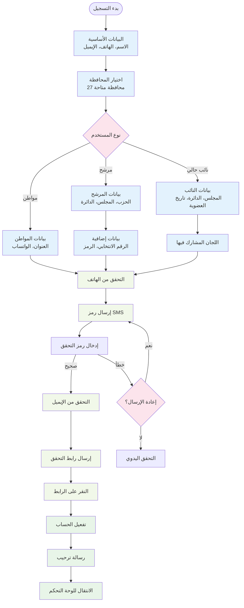
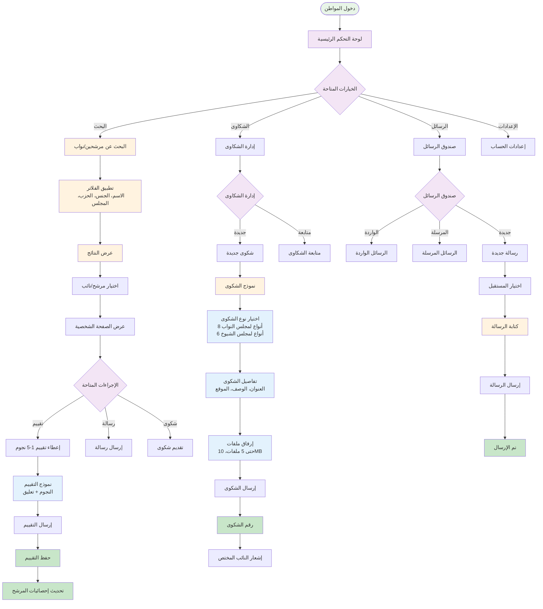
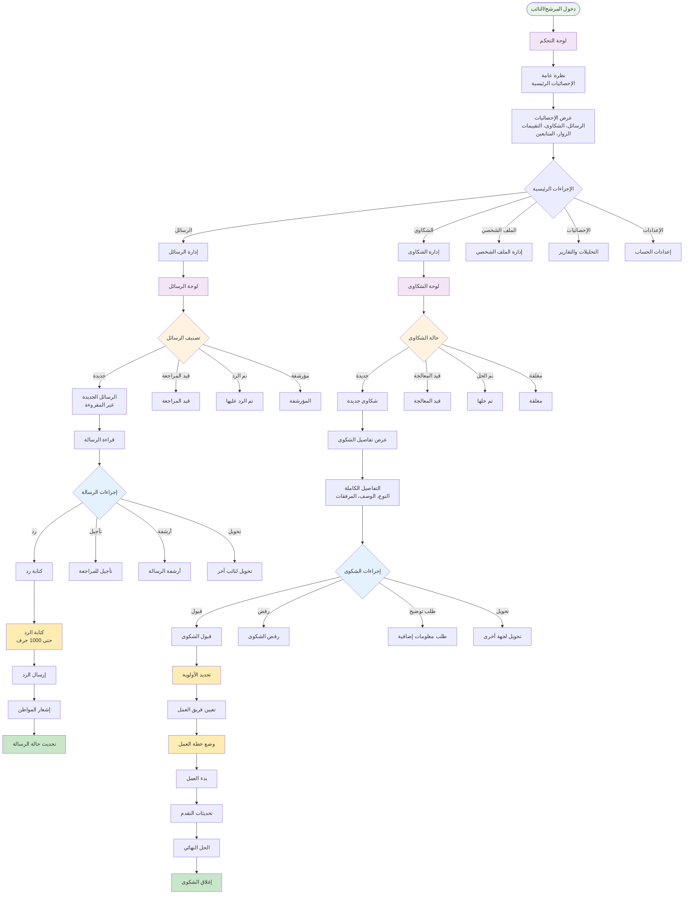
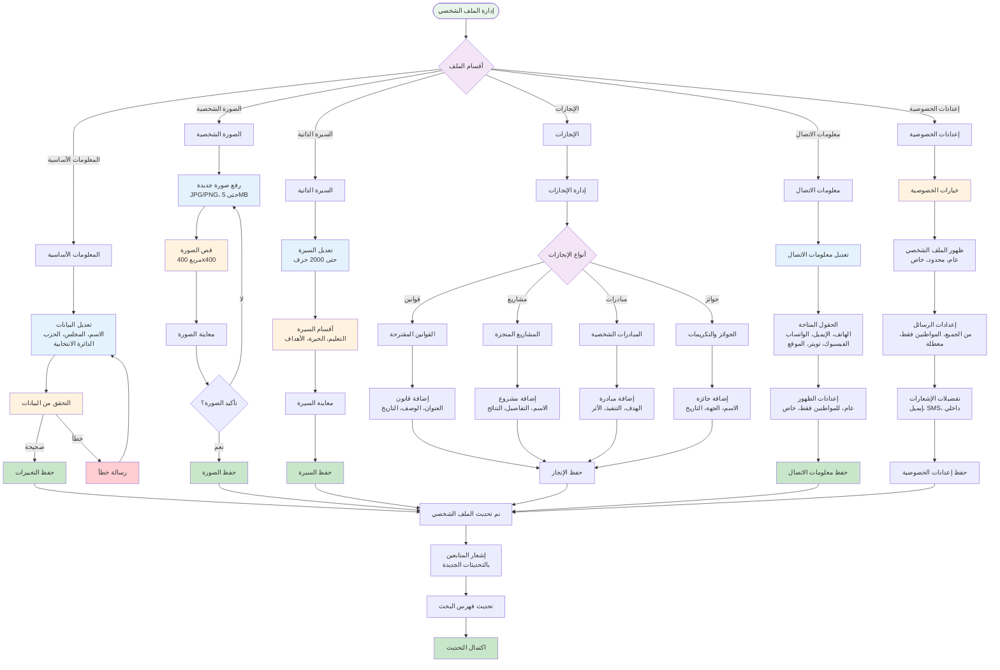
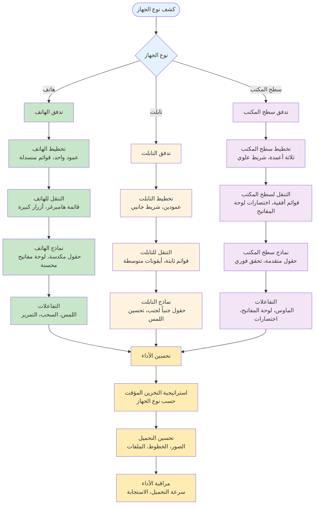
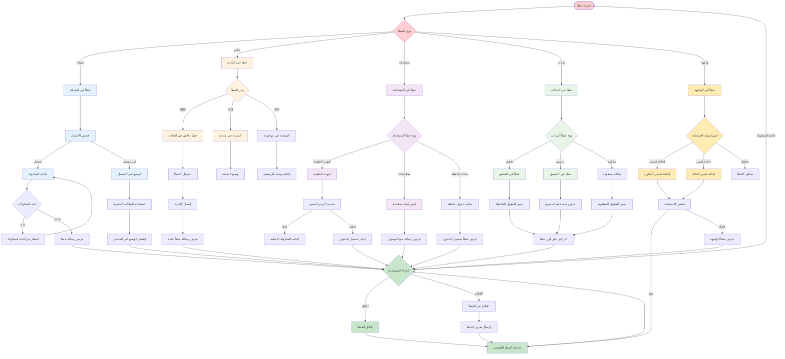

# مخططات تدفق المستخدمين - مشروع Naebak

---

## 🎯 **نظرة عامة على رحلات المستخدمين**

### **أنواع المستخدمين:**
1. **الزائر** - غير مسجل
2. **المواطن** - له صوت انتخابي
3. **المرشح** - مرشح لعضوية مجلس
4. **النائب الحالي** - عضو حالي في مجلس
5. **الإدارة** - مدير النظام

---

## 🚪 **1. رحلة الزائر (Visitor Journey)**

### **الدخول الأولي:**
```mermaid
flowchart TD
    START([زائر يدخل الموقع]) --> LANDING[صفحة الهبوط]
    LANDING --> CHOICE{ماذا يريد؟}
    
    CHOICE -->|تصفح| BROWSE[تصفح كزائر]
    CHOICE -->|تسجيل| REGISTER[نموذج التسجيل]
    CHOICE -->|دخول| LOGIN[نموذج الدخول]
    
    BROWSE --> VIEW_REPS[عرض المرشحين/النواب]
    VIEW_REPS --> LIMITED[عرض محدود<br/>بدون تفاعل]
    LIMITED --> PROMPT[دعوة للتسجيل]
    PROMPT --> REGISTER
    
    REGISTER --> REG_FORM[ملء بيانات التسجيل]
    REG_FORM --> VERIFY[التحقق من الهاتف]
    VERIFY --> SUCCESS[تسجيل ناجح]
    SUCCESS --> DASHBOARD[لوحة التحكم]
    
    LOGIN --> AUTH[التحقق من البيانات]
    AUTH -->|صحيح| DASHBOARD
    AUTH -->|خطأ| ERROR[رسالة خطأ]
    ERROR --> LOGIN
    
    classDef start fill:#e8f5e8
    classDef process fill:#fff3e0
    classDef decision fill:#f3e5f5
    classDef end fill:#ffebee
    
    class START start
    class LANDING,BROWSE,VIEW_REPS,REG_FORM,VERIFY,AUTH process
    class CHOICE decision
    class SUCCESS,DASHBOARD,ERROR end
```

### **تدفق التسجيل التفصيلي:**


---

## 👤 **2. رحلة المواطن (Citizen Journey)**

### **الاستخدام اليومي:**


### **رحلة تقديم الشكوى التفصيلية:**
```mermaid
flowchart TD
    START_COMP([تقديم شكوى]) --> TARGET{إلى من الشكوى؟}
    
    TARGET -->|نائب محدد| SELECT_REP[اختيار النائب]
    TARGET -->|تعيين تلقائي| AUTO_ASSIGN[التعيين التلقائي<br/>حسب المحافظة والنوع]
    
    SELECT_REP --> COMP_FORM[نموذج الشكوى]
    AUTO_ASSIGN --> COMP_FORM
    
    COMP_FORM --> TITLE[عنوان الشكوى<br/>حتى 100 حرف]
    TITLE --> CATEGORY[فئة الشكوى]
    
    CATEGORY --> CAT_CHOICE{نوع المجلس}
    CAT_CHOICE -->|مجلس النواب| PARLIAMENT_CATS[8 فئات متاحة<br/>البنية التحتية، الصحة، التعليم<br/>الأمن، الخدمات، النقل<br/>البيئة، الإسكان]
    CAT_CHOICE -->|مجلس الشيوخ| SENATE_CATS[6 فئات متاحة<br/>التشريع، الرقابة، الاقتصاد<br/>الشؤون الخارجية، الثقافة، الاجتماعية]
    
    PARLIAMENT_CATS --> DESCRIPTION[وصف تفصيلي<br/>حتى 1000 حرف]
    SENATE_CATS --> DESCRIPTION
    
    DESCRIPTION --> LOCATION_OPT[الموقع (اختياري)<br/>عنوان أو إحداثيات]
    LOCATION_OPT --> URGENCY[مستوى الأولوية<br/>عادي، مهم، عاجل]
    URGENCY --> ATTACHMENTS_OPT[المرفقات (اختياري)]
    
    ATTACHMENTS_OPT --> FILE_CHECK{هل توجد ملفات؟}
    FILE_CHECK -->|نعم| UPLOAD_FILES[رفع الملفات<br/>حتى 5 ملفات<br/>10MB لكل ملف]
    FILE_CHECK -->|لا| REVIEW
    
    UPLOAD_FILES --> FILE_VALIDATION[فحص الملفات<br/>النوع، الحجم، الفيروسات]
    FILE_VALIDATION -->|صالحة| REVIEW[مراجعة الشكوى]
    FILE_VALIDATION -->|غير صالحة| FILE_ERROR[رسالة خطأ]
    FILE_ERROR --> ATTACHMENTS_OPT
    
    REVIEW --> CONFIRM{تأكيد الإرسال؟}
    CONFIRM -->|نعم| SUBMIT[إرسال الشكوى]
    CONFIRM -->|لا| COMP_FORM
    
    SUBMIT --> GENERATE_ID[إنشاء رقم الشكوى<br/>COMP-YYYY-XXXXXX]
    GENERATE_ID --> SAVE_DB[حفظ في قاعدة البيانات]
    SAVE_DB --> NOTIFY_SYSTEM[إشعار النظام]
    
    NOTIFY_SYSTEM --> ASSIGN_REP[تعيين النائب المختص]
    ASSIGN_REP --> NOTIFY_REP[إشعار النائب<br/>إيميل + إشعار داخلي]
    NOTIFY_REP --> NOTIFY_CITIZEN[إشعار المواطن<br/>رقم الشكوى + رابط المتابعة]
    NOTIFY_CITIZEN --> SUCCESS[تم تقديم الشكوى بنجاح]
    
    classDef start fill:#e8f5e8
    classDef decision fill:#f3e5f5
    classDef input fill:#e3f2fd
    classDef process fill:#fff3e0
    classDef validation fill:#ffecb3
    classDef success fill:#c8e6c9
    classDef error fill:#ffcdd2
    
    class START_COMP start
    class TARGET,CAT_CHOICE,FILE_CHECK,CONFIRM decision
    class TITLE,DESCRIPTION,LOCATION_OPT,URGENCY,UPLOAD_FILES input
    class COMP_FORM,AUTO_ASSIGN,GENERATE_ID,SAVE_DB,NOTIFY_SYSTEM process
    class FILE_VALIDATION validation
    class SUCCESS success
    class FILE_ERROR error
```

---

## 🏛️ **3. رحلة المرشح/النائب (Representative Journey)**

### **لوحة التحكم الرئيسية:**


### **إدارة الملف الشخصي:**


---

## 👨‍💼 **4. رحلة الإدارة (Admin Journey)**

### **لوحة تحكم الإدارة:**

```mermaid
flowchart TD
    ADMIN_LOGIN([دخول الإدارة]) --> ADMIN_DASHBOARD[لوحة تحكم الإدارة]
    ADMIN_DASHBOARD --> ADMIN_OVERVIEW[نظرة عامة<br/>إحصائيات النظام]
    
    ADMIN_OVERVIEW --> ADMIN_MENU{قائمة الإدارة}
    
    ADMIN_MENU -->|المستخدمين| USER_MGMT[إدارة المستخدمين]
    ADMIN_MENU -->|الأحزاب| PARTY_MGMT[إدارة الأحزاب]
    ADMIN_MENU -->|أنواع الشكاوى| COMPLAINT_TYPES[إدارة أنواع الشكاوى]
    ADMIN_MENU -->|المحتوى| CONTENT_MGMT[إدارة المحتوى]
    ADMIN_MENU -->|الإعدادات| SYSTEM_SETTINGS[إعدادات النظام]
    ADMIN_MENU -->|التقارير| REPORTS[التقارير والإحصائيات]
    ADMIN_MENU -->|النسخ الاحتياطي| BACKUP[النسخ الاحتياطي]
    
    %% إدارة المستخدمين
    USER_MGMT --> USER_ACTIONS{إجراءات المستخدمين}
    USER_ACTIONS -->|عرض| VIEW_USERS[عرض جميع المستخدمين]
    USER_ACTIONS -->|بحث| SEARCH_USERS[البحث في المستخدمين]
    USER_ACTIONS -->|تعديل| EDIT_USER[تعديل مستخدم]
    USER_ACTIONS -->|حظر| BAN_USER[حظر مستخدم]
    USER_ACTIONS -->|إحصائيات| USER_STATS[إحصائيات المستخدمين]
    
    VIEW_USERS --> USER_LIST[قائمة المستخدمين<br/>مع الفلاتر والترتيب]
    USER_LIST --> SELECT_USER[اختيار مستخدم]
    SELECT_USER --> USER_DETAILS[تفاصيل المستخدم]
    USER_DETAILS --> USER_ACTIONS
    
    %% إدارة الأحزاب
    PARTY_MGMT --> PARTY_ACTIONS{إجراءات الأحزاب}
    PARTY_ACTIONS -->|عرض| VIEW_PARTIES[عرض جميع الأحزاب]
    PARTY_ACTIONS -->|إضافة| ADD_PARTY[إضافة حزب جديد]
    PARTY_ACTIONS -->|تعديل| EDIT_PARTY[تعديل حزب]
    PARTY_ACTIONS -->|حذف| DELETE_PARTY[حذف حزب]
    
    ADD_PARTY --> PARTY_FORM[نموذج الحزب<br/>الاسم، الشعار، اللون<br/>الوصف، الموقع]
    PARTY_FORM --> VALIDATE_PARTY[التحقق من البيانات]
    VALIDATE_PARTY -->|صحيحة| SAVE_PARTY[حفظ الحزب]
    VALIDATE_PARTY -->|خطأ| PARTY_ERROR[رسالة خطأ]
    PARTY_ERROR --> PARTY_FORM
    
    DELETE_PARTY --> CONFIRM_DELETE{تأكيد الحذف؟}
    CONFIRM_DELETE -->|نعم| CHECK_MEMBERS[فحص الأعضاء]
    CHECK_MEMBERS -->|يوجد أعضاء| TRANSFER_MEMBERS[نقل الأعضاء<br/>لحزب آخر]
    CHECK_MEMBERS -->|لا يوجد| REMOVE_PARTY[حذف الحزب]
    TRANSFER_MEMBERS --> REMOVE_PARTY
    
    %% إدارة أنواع الشكاوى
    COMPLAINT_TYPES --> COMP_TYPE_ACTIONS{إجراءات أنواع الشكاوى}
    COMP_TYPE_ACTIONS -->|عرض| VIEW_COMP_TYPES[عرض جميع الأنواع]
    COMP_TYPE_ACTIONS -->|إضافة| ADD_COMP_TYPE[إضافة نوع جديد]
    COMP_TYPE_ACTIONS -->|تعديل| EDIT_COMP_TYPE[تعديل نوع]
    COMP_TYPE_ACTIONS -->|حذف| DELETE_COMP_TYPE[حذف نوع]
    
    ADD_COMP_TYPE --> COMP_TYPE_FORM[نموذج النوع<br/>الاسم، الوصف، اللون<br/>الأيقونة، المجلس المختص]
    COMP_TYPE_FORM --> SAVE_COMP_TYPE[حفظ النوع]
    
    DELETE_COMP_TYPE --> CHECK_COMPLAINTS[فحص الشكاوى الموجودة]
    CHECK_COMPLAINTS -->|يوجد شكاوى| REASSIGN_COMPLAINTS[إعادة تصنيف الشكاوى]
    CHECK_COMPLAINTS -->|لا يوجد| REMOVE_COMP_TYPE[حذف النوع]
    
    %% إدارة المحتوى
    CONTENT_MGMT --> CONTENT_ACTIONS{إجراءات المحتوى}
    CONTENT_ACTIONS -->|الأخبار| NEWS_MGMT[إدارة الأخبار]
    CONTENT_ACTIONS -->|البنرات| BANNER_MGMT[إدارة البنرات]
    CONTENT_ACTIONS -->|الصفحات| PAGE_MGMT[إدارة الصفحات]
    
    NEWS_MGMT --> NEWS_LIST[قائمة الأخبار]
    NEWS_LIST --> NEWS_ACTIONS_SUB{إجراءات الأخبار}
    NEWS_ACTIONS_SUB -->|إضافة| ADD_NEWS[إضافة خبر]
    NEWS_ACTIONS_SUB -->|تعديل| EDIT_NEWS[تعديل خبر]
    NEWS_ACTIONS_SUB -->|حذف| DELETE_NEWS[حذف خبر]
    NEWS_ACTIONS_SUB -->|جدولة| SCHEDULE_NEWS[جدولة الأخبار]
    
    BANNER_MGMT --> BANNER_ACTIONS_SUB{إجراءات البنرات}
    BANNER_ACTIONS_SUB -->|رفع| UPLOAD_BANNER[رفع بنر جديد]
    BANNER_ACTIONS_SUB -->|تعديل| EDIT_BANNER[تعديل بنر]
    BANNER_ACTIONS_SUB -->|حذف| DELETE_BANNER[حذف بنر]
    BANNER_ACTIONS_SUB -->|جدولة| SCHEDULE_BANNER[جدولة البنر]
    
    %% إعدادات النظام
    SYSTEM_SETTINGS --> SETTINGS_CATEGORIES{فئات الإعدادات}
    SETTINGS_CATEGORIES -->|عامة| GENERAL_SETTINGS[الإعدادات العامة]
    SETTINGS_CATEGORIES -->|الأمان| SECURITY_SETTINGS[إعدادات الأمان]
    SETTINGS_CATEGORIES -->|الإشعارات| NOTIFICATION_SETTINGS[إعدادات الإشعارات]
    SETTINGS_CATEGORIES -->|الملفات| FILE_SETTINGS[إعدادات الملفات]
    
    GENERAL_SETTINGS --> EDIT_GENERAL[تعديل الإعدادات العامة<br/>اسم الموقع، الوصف<br/>معلومات الاتصال]
    SECURITY_SETTINGS --> EDIT_SECURITY[تعديل إعدادات الأمان<br/>كلمات المرور، الجلسات<br/>محاولات الدخول]
    FILE_SETTINGS --> EDIT_FILES[تعديل إعدادات الملفات<br/>الحد الأقصى للحجم<br/>الأنواع المسموحة]
    
    %% التقارير
    REPORTS --> REPORT_TYPES{أنواع التقارير}
    REPORT_TYPES -->|المستخدمين| USER_REPORTS[تقارير المستخدمين]
    REPORT_TYPES -->|الشكاوى| COMPLAINT_REPORTS[تقارير الشكاوى]
    REPORT_TYPES -->|الأداء| PERFORMANCE_REPORTS[تقارير الأداء]
    REPORT_TYPES -->|الإحصائيات| STATISTICS_REPORTS[التقارير الإحصائية]
    
    USER_REPORTS --> GENERATE_USER_REPORT[إنشاء تقرير المستخدمين]
    COMPLAINT_REPORTS --> GENERATE_COMPLAINT_REPORT[إنشاء تقرير الشكاوى]
    PERFORMANCE_REPORTS --> GENERATE_PERFORMANCE_REPORT[إنشاء تقرير الأداء]
    
    GENERATE_USER_REPORT --> EXPORT_REPORT[تصدير التقرير<br/>PDF, Excel, CSV]
    GENERATE_COMPLAINT_REPORT --> EXPORT_REPORT
    GENERATE_PERFORMANCE_REPORT --> EXPORT_REPORT
    
    classDef admin fill:#e8f5e8
    classDef menu fill:#f3e5f5
    classDef action fill:#e3f2fd
    classDef form fill:#fff3e0
    classDef process fill:#ffecb3
    classDef success fill:#c8e6c9
    classDef error fill:#ffcdd2
    
    class ADMIN_LOGIN admin
    class ADMIN_MENU,USER_ACTIONS,PARTY_ACTIONS,COMP_TYPE_ACTIONS menu
    class VIEW_USERS,ADD_PARTY,EDIT_PARTY,DELETE_PARTY action
    class PARTY_FORM,COMP_TYPE_FORM form
    class VALIDATE_PARTY,CHECK_MEMBERS,GENERATE_USER_REPORT process
    class SAVE_PARTY,REMOVE_PARTY,EXPORT_REPORT success
    class PARTY_ERROR error
```


---

## 📱 **5. تدفق الاستجابة للأجهزة المختلفة**

### **التكيف مع الأجهزة:**


---

## 🔄 **6. تدفق معالجة الأخطاء**

### **استراتيجية معالجة الأخطاء:**


---

## 📊 **خلاصة مخططات التدفق**

### **الإحصائيات:**
- **5 أنواع مستخدمين** مختلفة
- **15+ رحلة مستخدم** مفصلة
- **50+ نقطة قرار** في التدفقات
- **100+ خطوة عمل** محددة
- **معالجة شاملة للأخطاء** في جميع المسارات

### **الفوائد المحققة:**
✅ **وضوح كامل** لرحلة كل مستخدم  
✅ **تحديد نقاط الاختناق** المحتملة  
✅ **معالجة جميع الحالات** الاستثنائية  
✅ **تحسين تجربة المستخدم** على جميع الأجهزة  
✅ **دليل واضح للمطورين** والمصممين  

هذه المخططات توفر فهماً عميقاً وشاملاً لكيفية تفاعل المستخدمين مع النظام! 🎯
