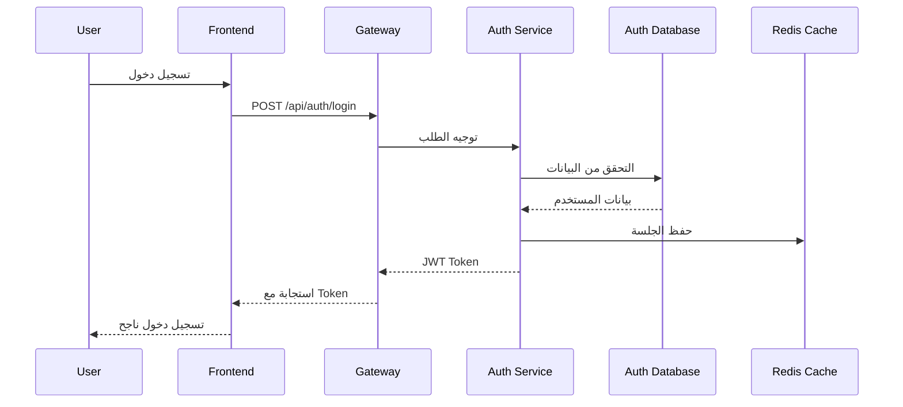
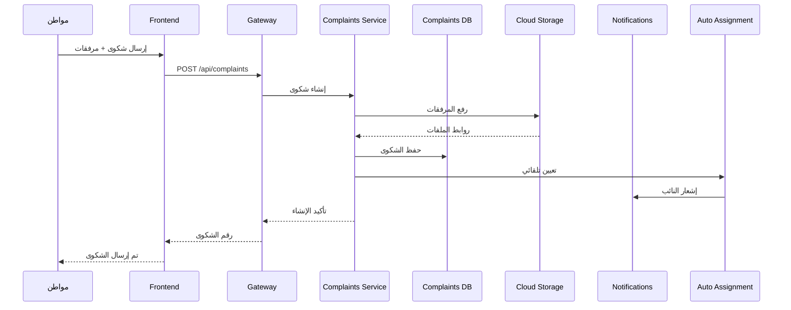
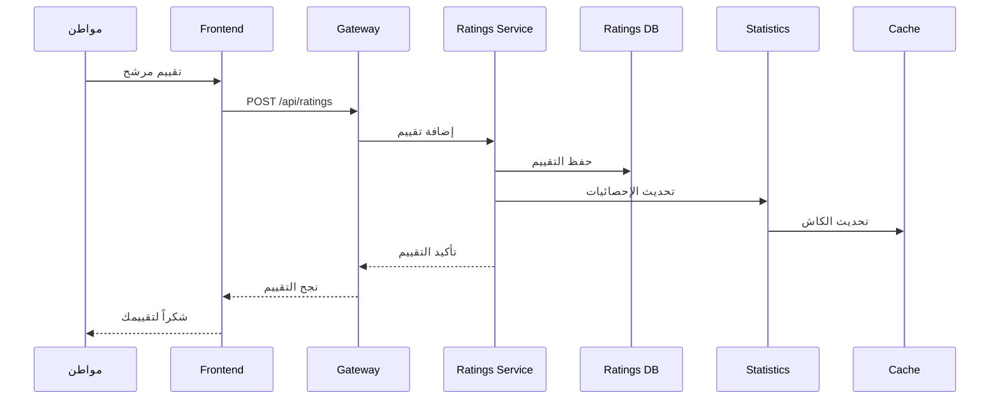
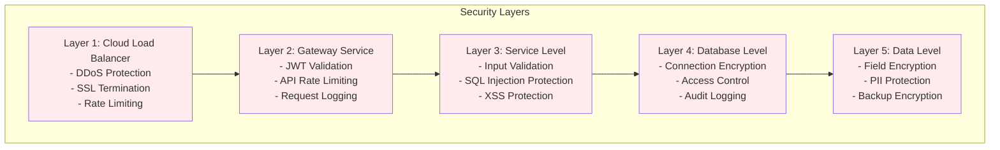
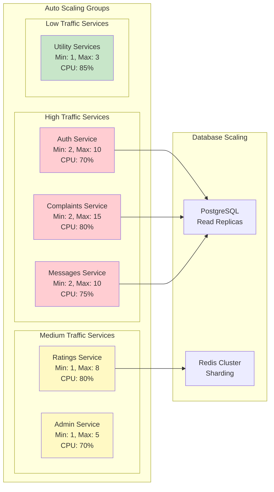
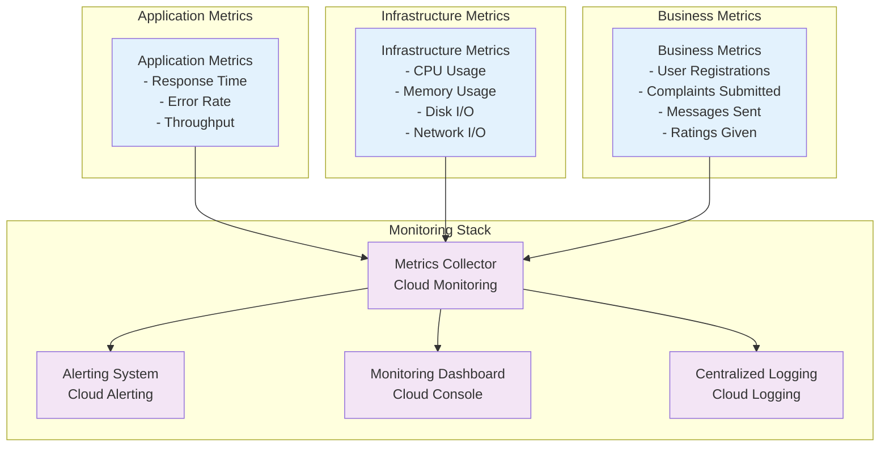

# مخطط معمارية النظام - مشروع Naebak

---

## 🏗️ **نظرة عامة على المعمارية**

```mermaid
graph TB
    subgraph "Frontend Layer"
        FE[Next.js Frontend<br/>Port: 3000]
        FE --> |HTTPS| LB
    end
    
    subgraph "Load Balancer & Gateway"
        LB[Cloud Load Balancer]
        GW[Gateway Service<br/>Port: 8013]
        LB --> GW
    end
    
    subgraph "Core Services (Django)"
        AUTH[Auth Service<br/>Port: 8001]
        ADMIN[Admin Service<br/>Port: 8002]
        COMP[Complaints Service<br/>Port: 8003]
        MSG[Messages Service<br/>Port: 8004]
        RATE[Ratings Service<br/>Port: 8005]
    end
    
    subgraph "Utility Services (Flask)"
        VIS[Visitor Counter<br/>Port: 8006]
        NEWS[News Service<br/>Port: 8007]
        NOTIF[Notifications<br/>Port: 8008]
        BAN[Banners Service<br/>Port: 8009]
        CONT[Content Service<br/>Port: 8010]
        CACHE[Cache Service<br/>Port: 8011]
        STATS[Statistics<br/>Port: 8012]
        THEME[Themes Service<br/>Port: 8014]
    end
    
    subgraph "Database Layer"
        PG1[(PostgreSQL<br/>Auth DB)]
        PG2[(PostgreSQL<br/>Admin DB)]
        PG3[(PostgreSQL<br/>Complaints DB)]
        PG4[(PostgreSQL<br/>Messages DB)]
        PG5[(PostgreSQL<br/>Ratings DB)]
        
        SQLITE1[(SQLite<br/>Visitor DB)]
        SQLITE2[(SQLite<br/>News DB)]
        SQLITE3[(SQLite<br/>Banners DB)]
        SQLITE4[(SQLite<br/>Content DB)]
        
        REDIS1[(Redis<br/>Cache)]
        REDIS2[(Redis<br/>Stats)]
    end
    
    subgraph "External Services"
        GCS[Google Cloud Storage<br/>Files & Images]
        SM[Secret Manager<br/>Credentials]
        MON[Cloud Monitoring<br/>Logs & Metrics]
    end
    
    %% Connections
    GW --> AUTH
    GW --> ADMIN
    GW --> COMP
    GW --> MSG
    GW --> RATE
    GW --> VIS
    GW --> NEWS
    GW --> NOTIF
    GW --> BAN
    GW --> CONT
    GW --> CACHE
    GW --> STATS
    GW --> THEME
    
    AUTH --> PG1
    ADMIN --> PG2
    COMP --> PG3
    MSG --> PG4
    RATE --> PG5
    
    VIS --> SQLITE1
    NEWS --> SQLITE2
    BAN --> SQLITE3
    CONT --> SQLITE4
    
    CACHE --> REDIS1
    STATS --> REDIS2
    
    COMP --> GCS
    BAN --> GCS
    
    AUTH --> SM
    ADMIN --> SM
    
    ALL --> MON
    
    %% Styling
    classDef frontend fill:#e1f5fe
    classDef gateway fill:#f3e5f5
    classDef core fill:#e8f5e8
    classDef utility fill:#fff3e0
    classDef database fill:#fce4ec
    classDef external fill:#f1f8e9
    
    class FE frontend
    class LB,GW gateway
    class AUTH,ADMIN,COMP,MSG,RATE core
    class VIS,NEWS,NOTIF,BAN,CONT,CACHE,STATS,THEME utility
    class PG1,PG2,PG3,PG4,PG5,SQLITE1,SQLITE2,SQLITE3,SQLITE4,REDIS1,REDIS2 database
    class GCS,SM,MON external
```



---

## 🔄 **تدفق البيانات الرئيسي**

### **1. تدفق المصادقة:**


### **2. تدفق الشكاوى:**


### **3. تدفق التقييم:**


---

## 🛡️ **طبقات الأمان**

### **Security Layers:**


---

## 📊 **توزيع الأحمال والتوسع**

### **Scaling Strategy:**


---

## 🔄 **استراتيجية النسخ الاحتياطي**

### **Backup Architecture:**
```mermaid
graph TB
    subgraph "Production Data"
        PROD_PG[(Production PostgreSQL)]
        PROD_REDIS[(Production Redis)]
        PROD_FILES[Production Files<br/>Cloud Storage]
    end
    
    subgraph "Backup Systems"
        BACKUP_PG[(Backup PostgreSQL<br/>Daily + PITR)]
        BACKUP_REDIS[(Backup Redis<br/>RDB + AOF)]
        BACKUP_FILES[Backup Files<br/>Multi-Region)]
    end
    
    subgraph "Disaster Recovery"
        DR_PG[(DR PostgreSQL<br/>Cross-Region)]
        DR_REDIS[(DR Redis<br/>Cross-Region)]
        DR_FILES[DR Files<br/>Cross-Region]
    end
    
    PROD_PG -->|Daily Backup| BACKUP_PG
    PROD_REDIS -->|6h Snapshot| BACKUP_REDIS
    PROD_FILES -->|Real-time Sync| BACKUP_FILES
    
    BACKUP_PG -->|Weekly Sync| DR_PG
    BACKUP_REDIS -->|Daily Sync| DR_REDIS
    BACKUP_FILES -->|Real-time Sync| DR_FILES
    
    classDef prod fill:#e8f5e8
    classDef backup fill:#fff3e0
    classDef dr fill:#ffebee
    
    class PROD_PG,PROD_REDIS,PROD_FILES prod
    class BACKUP_PG,BACKUP_REDIS,BACKUP_FILES backup
    class DR_PG,DR_REDIS,DR_FILES dr
```

---

## 📈 **مراقبة النظام**

### **Monitoring Architecture:**


---

## 🚀 **استراتيجية النشر**

### **Deployment Pipeline:**

```mermaid
graph LR
    subgraph "Development"
        DEV[Development<br/>Local Environment]
        TEST[Testing<br/>Unit + Integration]
    end
    
    subgraph "CI/CD Pipeline"
        BUILD[Build<br/>Docker Images]
        SCAN[Security Scan<br/>Vulnerability Check]
        DEPLOY_STAGE[Deploy to Staging<br/>Cloud Run]
        E2E[End-to-End Tests<br/>Automated Testing]
    end
    
    subgraph "Production"
        DEPLOY_PROD[Deploy to Production<br/>Blue-Green Deployment]
        MONITOR[Monitor<br/>Health Checks]
        ROLLBACK[Rollback<br/>If Issues Detected]
    end
    
    DEV --> TEST
    TEST --> BUILD
    BUILD --> SCAN
    SCAN --> DEPLOY_STAGE
    DEPLOY_STAGE --> E2E
    E2E --> DEPLOY_PROD
    DEPLOY_PROD --> MONITOR
    MONITOR --> ROLLBACK
    
    classDef dev fill:#e8f5e8
    classDef cicd fill:#fff3e0
    classDef prod fill:#ffebee
    
    class DEV,TEST dev
    class BUILD,SCAN,DEPLOY_STAGE,E2E cicd
    class DEPLOY_PROD,MONITOR,ROLLBACK prod
```


---

## 🔧 **تكوين البيئات**

### **Environment Configuration:**

#### **Development Environment:**
```yaml
Environment: Development
Services: All services running locally
Database: Local PostgreSQL + SQLite
Cache: Local Redis
Storage: Local filesystem
Monitoring: Basic logging
Security: Minimal (development only)
```

#### **Staging Environment:**
```yaml
Environment: Staging
Services: Cloud Run (minimal instances)
Database: Cloud SQL (small instances)
Cache: Cloud Redis (basic tier)
Storage: Cloud Storage (single region)
Monitoring: Full monitoring enabled
Security: Production-like security
```

#### **Production Environment:**
```yaml
Environment: Production
Services: Cloud Run (auto-scaling)
Database: Cloud SQL (high availability)
Cache: Cloud Redis (standard tier)
Storage: Cloud Storage (multi-region)
Monitoring: Full monitoring + alerting
Security: Maximum security enabled
```

---

## 📋 **مواصفات الأداء**

### **Performance Targets:**

| Service | Response Time | Throughput | Availability |
|---------|---------------|------------|--------------|
| Auth Service | < 200ms | 1000 req/min | 99.9% |
| Complaints Service | < 500ms | 500 req/min | 99.5% |
| Messages Service | < 300ms | 800 req/min | 99.7% |
| Ratings Service | < 150ms | 1200 req/min | 99.8% |
| Utility Services | < 100ms | 2000 req/min | 99.0% |

### **Resource Allocation:**

| Service Type | CPU | Memory | Storage | Network |
|--------------|-----|--------|---------|---------|
| Core Services | 0.5-1.0 vCPU | 512Mi-1Gi | 20-50GB | 1Gbps |
| Utility Services | 0.1-0.3 vCPU | 64-256Mi | 5-15GB | 100Mbps |
| Database | 1-2 vCPU | 2-4Gi | 100-500GB | 1Gbps |
| Cache | 0.5 vCPU | 1-2Gi | 10GB | 1Gbps |

---

## 🔍 **نقاط المراقبة الحرجة**

### **Critical Monitoring Points:**

1. **Authentication Failures** - معدل فشل تسجيل الدخول
2. **Database Connection Pool** - استخدام pool الاتصالات
3. **File Upload Errors** - أخطاء رفع الملفات
4. **API Response Times** - أوقات استجابة APIs
5. **Memory Usage** - استخدام الذاكرة
6. **Disk Space** - المساحة المتاحة
7. **Network Latency** - زمن الاستجابة الشبكي
8. **Error Rates** - معدلات الأخطاء

### **Alert Thresholds:**

| Metric | Warning | Critical | Action |
|--------|---------|----------|--------|
| CPU Usage | > 70% | > 85% | Auto-scale |
| Memory Usage | > 80% | > 90% | Restart service |
| Error Rate | > 5% | > 10% | Investigate |
| Response Time | > 1s | > 2s | Check performance |
| Disk Usage | > 80% | > 90% | Clean up / expand |

---

## 🎯 **خلاصة المعمارية**

### **المبادئ الأساسية:**
1. **Microservices Architecture** - خدمات مصغرة منفصلة
2. **Horizontal Scaling** - توسع أفقي حسب الحاجة
3. **High Availability** - توفر عالي مع redundancy
4. **Security by Design** - الأمان مدمج في التصميم
5. **Monitoring First** - المراقبة أولوية قصوى
6. **Cloud Native** - مصمم للسحابة
7. **Cost Optimization** - تحسين التكاليف
8. **Developer Friendly** - سهل التطوير والصيانة

### **الفوائد المحققة:**
✅ **قابلية التوسع** - يتحمل ملايين المستخدمين  
✅ **الموثوقية** - نسبة توفر عالية  
✅ **الأمان** - حماية متعددة الطبقات  
✅ **الأداء** - استجابة سريعة  
✅ **المرونة** - سهولة التطوير والتحديث  
✅ **التكلفة** - دفع حسب الاستخدام  

هذه المعمارية تضمن نظاماً قوياً وقابلاً للتوسع يلبي جميع متطلبات مشروع Naebak! 🚀
