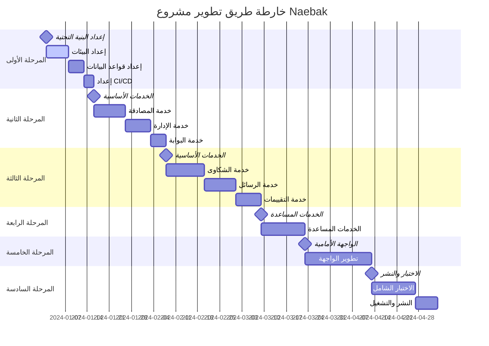

# خارطة طريق التطوير - مشروع Naebak

---

## 🎯 **نظرة عامة على المشروع**

### **الهدف الرئيسي:**
تطوير منصة إلكترونية شاملة تربط بين المواطنين والمرشحين/النواب في مصر، مع نظام شكاوى متقدم وتقييم شفاف.

### **المدة الإجمالية:** 16 أسبوع (4 أشهر)
### **الفريق المقترح:** 6-8 مطورين
### **الميزانية المقدرة:** متوسطة إلى عالية
### **المخاطر:** متوسطة

---

## 📅 **المراحل الرئيسية**



---

## 🏗️ **المرحلة الأولى: إعداد البنية التحتية (الأسابيع 1-2)**

### **الأهداف:**
- إعداد بيئة التطوير والإنتاج
- تكوين قواعد البيانات
- إعداد أنظمة CI/CD والمراقبة

### **المهام التفصيلية:**

#### **الأسبوع الأول: إعداد البيئات**
```yaml
المهام:
  - إعداد Google Cloud Project
  - تكوين Cloud Run للخدمات
  - إعداد Cloud SQL (PostgreSQL)
  - تكوين Redis للتخزين المؤقت
  - إعداد Cloud Storage للملفات
  - تكوين Secret Manager
  - إعداد Cloud Monitoring

المخرجات:
  - بيئة تطوير جاهزة
  - بيئة إنتاج أساسية
  - وثائق الإعداد

المسؤوليات:
  - DevOps Engineer: 70%
  - Backend Lead: 30%

المخاطر:
  - تأخير في إعداد الصلاحيات
  - مشاكل في تكوين الشبكة
```

#### **الأسبوع الثاني: قواعد البيانات والأتمتة**
```yaml
المهام:
  - إنشاء قواعد البيانات لكل خدمة
  - تطبيق المخططات الأولية
  - إعداد النسخ الاحتياطية
  - تكوين GitHub Actions
  - إعداد Docker Registry
  - تكوين أنظمة المراقبة

المخرجات:
  - قواعد بيانات جاهزة
  - CI/CD pipeline فعال
  - نظام مراقبة يعمل

المسؤوليات:
  - Database Admin: 50%
  - DevOps Engineer: 50%

المعايير:
  - جميع قواعد البيانات متاحة
  - النشر التلقائي يعمل
  - المراقبة تسجل البيانات
```

---

## 🔐 **المرحلة الثانية: الخدمات الأساسية (الأسابيع 3-5)**

### **الأهداف:**
- تطوير خدمات المصادقة والإدارة والبوابة
- إنشاء الأساس للخدمات الأخرى
- تطبيق معايير الأمان

### **المهام التفصيلية:**

#### **الأسابيع 3-4: خدمة المصادقة**
```yaml
المهام:
  Sprint 1 (الأسبوع 3):
    - إعداد Django project
    - تطوير نماذج المستخدمين
    - تطبيق JWT authentication
    - APIs التسجيل والدخول
    - التحقق من الهاتف (SMS)
    
  Sprint 2 (الأسبوع 4):
    - التحقق من الإيميل
    - إدارة الجلسات
    - APIs إدارة الملف الشخصي
    - تطبيق Rate Limiting
    - كتابة الاختبارات

المخرجات:
  - خدمة مصادقة كاملة
  - APIs موثقة
  - اختبارات شاملة
  - نشر على Cloud Run

المسؤوليات:
  - Backend Developer 1: 80%
  - Security Specialist: 20%

معايير القبول:
  - تسجيل المستخدمين يعمل
  - التحقق من الهاتف فعال
  - JWT tokens آمنة
  - Rate limiting يعمل
  - 90%+ test coverage
```

#### **الأسبوع 5: خدمة الإدارة والبوابة**
```yaml
خدمة الإدارة:
  المهام:
    - Django Admin interface
    - إدارة الأحزاب
    - إدارة أنواع الشكاوى
    - إدارة المستخدمين
    - تصدير البيانات
    
  المخرجات:
    - لوحة إدارة كاملة
    - APIs الإدارة
    - نظام صلاحيات

خدمة البوابة:
  المهام:
    - Flask API Gateway
    - توجيه الطلبات
    - تجميع الاستجابات
    - Load balancing
    - Circuit breaker
    
  المخرجات:
    - API Gateway فعال
    - توجيه ذكي
    - مراقبة الأداء

المسؤوليات:
  - Backend Developer 2: خدمة الإدارة
  - Backend Developer 3: خدمة البوابة
```

---

## 💬 **المرحلة الثالثة: الخدمات الأساسية المتقدمة (الأسابيع 6-9)**

### **الأهداف:**
- تطوير خدمات الشكاوى والرسائل والتقييمات
- تطبيق ميزات متقدمة مثل رفع الملفات
- ربط الخدمات ببعضها البعض

### **المهام التفصيلية:**

#### **الأسابيع 6-7: خدمة الشكاوى**
```yaml
Sprint 1 (الأسبوع 6):
  المهام:
    - نماذج الشكاوى والمرفقات
    - APIs إنشاء الشكاوى
    - رفع الملفات لـ Cloud Storage
    - التحقق من أنواع الملفات
    - نظام الترقيم التلقائي
    
  المخرجات:
    - إنشاء شكاوى يعمل
    - رفع ملفات آمن
    - ترقيم منظم

Sprint 2 (الأسبوع 7):
  المهام:
    - نظام التعيين التلقائي
    - إدارة حالات الشكاوى
    - APIs البحث والفلترة
    - نظام الإشعارات
    - تتبع الشكاوى
    
  المخرجات:
    - تعيين ذكي للشكاوى
    - إدارة كاملة للحالات
    - بحث متقدم
    - إشعارات فورية

المسؤوليات:
  - Backend Developer 1: 60%
  - Backend Developer 2: 40%

معايير القبول:
  - رفع 5 ملفات، 10MB لكل ملف
  - تعيين تلقائي حسب المحافظة
  - 8 أنواع شكاوى لمجلس النواب
  - 6 أنواع شكاوى لمجلس الشيوخ
  - إشعارات فورية للنواب
```

#### **الأسابيع 8-9: خدمات الرسائل والتقييمات**
```yaml
خدمة الرسائل (الأسبوع 8):
  المهام:
    - نماذج الرسائل والمحادثات
    - APIs إرسال واستقبال الرسائل
    - WebSocket للرسائل الفورية
    - فلترة المحتوى غير اللائق
    - أرشفة الرسائل
    
  المخرجات:
    - نظام رسائل كامل
    - رسائل فورية
    - فلترة ذكية
    - أرشفة منظمة

خدمة التقييمات (الأسبوع 9):
  المهام:
    - نماذج التقييمات والإحصائيات
    - APIs إضافة وعرض التقييمات
    - حساب المتوسطات والترتيب
    - منع التقييمات المكررة
    - نظام المرشح المميز
    
  المخرجات:
    - نظام تقييم 5 نجوم
    - إحصائيات دقيقة
    - ترتيب المرشحين
    - نظام المميزين

المسؤوليات:
  - Backend Developer 3: خدمة الرسائل
  - Backend Developer 1: خدمة التقييمات

معايير القبول:
  - رسائل فورية تعمل
  - فلترة المحتوى فعالة
  - تقييم واحد لكل مواطن لكل مرشح
  - حساب المتوسط صحيح
  - المرشح المميز عند 100+ تقييم و4.5+ نجوم
```

---

## 🛠️ **المرحلة الرابعة: الخدمات المساعدة (الأسابيع 10-11)**

### **الأهداف:**
- تطوير الخدمات المساعدة الصغيرة
- تحسين الأداء والتخزين المؤقت
- إضافة ميزات إضافية

### **المهام التفصيلية:**

#### **الأسبوع 10: الخدمات الأساسية المساعدة**
```yaml
خدمة عداد الزوار:
  المهام:
    - Flask app بسيط
    - عد الزوار الفريدين
    - إعادة تعيين يومية
    - APIs للعرض والإحصائيات
    
خدمة الأخبار:
  المهام:
    - إدارة الأخبار المتحركة
    - APIs الإضافة والتعديل
    - تحكم في سرعة التمرير
    - جدولة الأخبار

خدمة الإشعارات:
  المهام:
    - نظام إشعارات شامل
    - إشعارات فورية
    - تفضيلات المستخدم
    - قوالب الإشعارات

المسؤوليات:
  - Backend Developer 2: عداد الزوار + الأخبار
  - Backend Developer 3: الإشعارات
```

#### **الأسبوع 11: الخدمات المتقدمة المساعدة**
```yaml
خدمة البنرات:
  المهام:
    - رفع وإدارة البنرات
    - تحسين الصور تلقائياً
    - جدولة عرض البنرات
    - إحصائيات المشاهدة

خدمة المحتوى:
  المهام:
    - إدارة محتوى الصفحات
    - دعم Markdown
    - تنقيح HTML
    - نظام الموافقة

خدمة الإحصائيات:
  المهام:
    - جمع وتحليل البيانات
    - إحصائيات فورية
    - تقارير دورية
    - لوحة معلومات

خدمة التخزين المؤقت:
  المهام:
    - إدارة Redis المركزية
    - استراتيجيات التخزين
    - تحسين الأداء
    - مراقبة الذاكرة

المسؤوليات:
  - Backend Developer 1: البنرات + المحتوى
  - Backend Developer 2: الإحصائيات + التخزين المؤقت
```

---

## 🎨 **المرحلة الخامسة: الواجهة الأمامية (الأسابيع 12-14)**

### **الأهداف:**
- تطوير واجهة المستخدم بـ Next.js
- تطبيق التصميم المتجاوب
- ربط جميع الخدمات

### **المهام التفصيلية:**

#### **الأسبوع 12: الإعداد والمكونات الأساسية**
```yaml
إعداد المشروع:
  المهام:
    - إنشاء Next.js project
    - تكوين Tailwind CSS
    - إعداد TypeScript
    - تكوين متغيرات البيئة
    - إعداد ESLint و Prettier

المكونات الأساسية:
  المهام:
    - Header مع اللوجو والقوائم
    - Footer مع الروابط الاجتماعية
    - الشريط الإخباري المتحرك
    - مكون البنر القابل للتخصيص
    - مكون عداد الزوار

المسؤوليات:
  - Frontend Developer 1: إعداد المشروع + Header/Footer
  - Frontend Developer 2: الشريط الإخباري + البنر + العداد

معايير القبول:
  - Header أبيض مع لوجو أخضر
  - Footer أخضر مع لوجو أبيض
  - شريط إخباري رمادي مع حدود برتقالية
  - عداد زوار يعمل بالوقت الفعلي
```

#### **الأسبوع 13: صفحات المصادقة والرئيسية**
```yaml
صفحات المصادقة:
  المهام:
    - صفحة الهبوط مع نماذج التسجيل/الدخول
    - نموذج تسجيل المواطن
    - نموذج تسجيل المرشح/النائب
    - التحقق من الهاتف والإيميل
    - معالجة الأخطاء

الصفحة الرئيسية:
  المهام:
    - لوحة تحكم المواطن
    - لوحة تحكم المرشح/النائب
    - عرض الإحصائيات
    - الإشعارات الفورية
    - القوائم التفاعلية

المسؤوليات:
  - Frontend Developer 1: صفحات المصادقة
  - Frontend Developer 2: الصفحة الرئيسية

معايير القبول:
  - تسجيل جميع أنواع المستخدمين
  - التحقق من الهاتف يعمل
  - لوحات تحكم مخصصة لكل نوع
  - إشعارات فورية تظهر
```

#### **الأسبوع 14: الصفحات المتقدمة**
```yaml
صفحة المرشحين/النواب:
  المهام:
    - عرض شبكة المرشحين
    - فلاتر متقدمة (الاسم، الجنس، الحزب، المجلس)
    - كروت المرشحين مع التقييمات
    - الصفحة الشخصية للمرشح
    - نظام التقييم التفاعلي

صفحات الشكاوى والرسائل:
  المهام:
    - نموذج تقديم الشكوى
    - رفع المرفقات
    - متابعة الشكاوى
    - صندوق الرسائل
    - محرر الرسائل

المسؤوليات:
  - Frontend Developer 1: صفحة المرشحين + الصفحة الشخصية
  - Frontend Developer 2: الشكاوى + الرسائل

معايير القبول:
  - فلاتر تعمل بسلاسة
  - رفع 5 ملفات، 10MB لكل ملف
  - تقييم بـ 5 نجوم يعمل
  - رسائل فورية تظهر
```

---

## 🧪 **المرحلة السادسة: الاختبار والنشر (الأسابيع 15-16)**

### **الأهداف:**
- اختبار شامل للنظام
- تحسين الأداء
- النشر النهائي

### **المهام التفصيلية:**

#### **الأسبوع 15: الاختبار الشامل**
```yaml
اختبارات الوحدة:
  المهام:
    - اختبار جميع APIs
    - اختبار نماذج البيانات
    - اختبار المكونات الأمامية
    - تحقيق 90%+ test coverage

اختبارات التكامل:
  المهام:
    - اختبار التكامل بين الخدمات
    - اختبار تدفق البيانات
    - اختبار المصادقة الشاملة
    - اختبار رفع الملفات

اختبارات الأداء:
  المهام:
    - اختبار الحمولة
    - اختبار سرعة الاستجابة
    - اختبار التوسع التلقائي
    - تحسين الاستعلامات

اختبارات الأمان:
  المهام:
    - فحص الثغرات الأمنية
    - اختبار حقن SQL
    - اختبار XSS
    - مراجعة الصلاحيات

المسؤوليات:
  - QA Engineer: 50%
  - جميع المطورين: 50%

معايير القبول:
  - جميع الاختبارات تمر
  - لا توجد ثغرات أمنية حرجة
  - زمن الاستجابة < 2 ثانية
  - النظام يتحمل 1000 مستخدم متزامن
```

#### **الأسبوع 16: النشر والتشغيل**
```yaml
النشر التدريجي:
  المهام:
    - نشر على بيئة الاختبار
    - اختبار المستخدمين النهائي
    - إصلاح الأخطاء الطارئة
    - نشر على بيئة الإنتاج

المراقبة والتحسين:
  المهام:
    - تفعيل جميع أنظمة المراقبة
    - إعداد التنبيهات
    - مراقبة الأداء
    - تحسين الاستعلامات

التوثيق والتدريب:
  المهام:
    - توثيق APIs النهائي
    - دليل المستخدم
    - دليل الإدارة
    - تدريب فريق الدعم

المسؤوليات:
  - DevOps Engineer: النشر والمراقبة
  - Technical Writer: التوثيق
  - جميع الفريق: الدعم

معايير القبول:
  - النظام يعمل بدون أخطاء
  - جميع الميزات تعمل
  - المراقبة تسجل البيانات
  - التوثيق مكتمل
```

---

## 👥 **تشكيل الفريق المقترح**

### **الأدوار والمسؤوليات:**

```yaml
Backend Team (4 أشخاص):
  Backend Lead:
    - إشراف تقني على الخدمات
    - مراجعة الكود
    - اتخاذ القرارات المعمارية
    
  Backend Developer 1:
    - خدمة المصادقة
    - خدمة التقييمات
    - خدمة البنرات والمحتوى
    
  Backend Developer 2:
    - خدمة الإدارة
    - خدمة عداد الزوار والأخبار
    - خدمة الإحصائيات والتخزين المؤقت
    
  Backend Developer 3:
    - خدمة البوابة
    - خدمة الرسائل
    - خدمة الإشعارات

Frontend Team (2 أشخاص):
  Frontend Developer 1:
    - إعداد المشروع والمكونات الأساسية
    - صفحات المصادقة
    - صفحة المرشحين والصفحة الشخصية
    
  Frontend Developer 2:
    - الشريط الإخباري والبنر والعداد
    - الصفحة الرئيسية
    - صفحات الشكاوى والرسائل

Infrastructure Team (2 أشخاص):
  DevOps Engineer:
    - إعداد البنية التحتية
    - CI/CD والنشر
    - المراقبة والتحسين
    
  Database Admin:
    - تصميم قواعد البيانات
    - تحسين الاستعلامات
    - النسخ الاحتياطية

Quality Assurance (1 شخص):
  QA Engineer:
    - كتابة خطط الاختبار
    - تنفيذ الاختبارات
    - تتبع الأخطاء

Specialized Roles (1 شخص):
  Security Specialist / Technical Writer:
    - مراجعة الأمان
    - كتابة التوثيق
    - دعم الفريق
```

---

## 📊 **مؤشرات الأداء الرئيسية (KPIs)**

### **مؤشرات التطوير:**
```yaml
الجودة:
  - Test Coverage: > 90%
  - Code Quality Score: > 8/10
  - Security Vulnerabilities: 0 Critical, < 5 Medium
  - Performance Score: > 85/100

الوقت:
  - Sprint Completion Rate: > 90%
  - Bug Fix Time: < 24 hours
  - Feature Delivery: On Schedule
  - Code Review Time: < 4 hours

الفريق:
  - Team Velocity: Stable/Increasing
  - Developer Satisfaction: > 4/5
  - Knowledge Sharing: Weekly Sessions
  - Documentation Coverage: > 80%
```

### **مؤشرات المنتج:**
```yaml
الأداء:
  - Page Load Time: < 2 seconds
  - API Response Time: < 500ms
  - Uptime: > 99.5%
  - Error Rate: < 1%

المستخدمين:
  - User Registration Rate: Target 1000/month
  - User Engagement: > 60%
  - Feature Adoption: > 70%
  - User Satisfaction: > 4/5

الأعمال:
  - Complaints Processed: > 95%
  - Response Time: < 48 hours
  - User Retention: > 80%
  - System Scalability: 10x current load
```

---

## ⚠️ **إدارة المخاطر**

### **المخاطر المحتملة والحلول:**

```yaml
المخاطر التقنية:
  خطر: تعقيد التكامل بين الخدمات
  احتمالية: متوسطة
  تأثير: عالي
  الحل: 
    - تطوير APIs موحدة
    - اختبارات تكامل مبكرة
    - استخدام API Gateway

  خطر: مشاكل الأداء مع الحمولة العالية
  احتمالية: متوسطة
  تأثير: عالي
  الحل:
    - اختبارات الحمولة المبكرة
    - تحسين قواعد البيانات
    - استخدام التخزين المؤقت

المخاطر البشرية:
  خطر: نقص الخبرة في تقنيات معينة
  احتمالية: عالية
  تأثير: متوسط
  الحل:
    - تدريب الفريق
    - استشارة خبراء خارجيين
    - توثيق شامل

  خطر: ترك أعضاء الفريق
  احتمالية: منخفضة
  تأثير: عالي
  الحل:
    - توثيق شامل للكود
    - مشاركة المعرفة
    - خطة الاستبدال

المخاطر الخارجية:
  خطر: تغيير المتطلبات
  احتمالية: عالية
  تأثير: متوسط
  الحل:
    - تطوير مرن (Agile)
    - مراجعات دورية
    - تصميم قابل للتوسع

  خطر: مشاكل في الخدمات السحابية
  احتمالية: منخفضة
  تأثير: عالي
  الحل:
    - خطة الاستعادة من الكوارث
    - نسخ احتياطية متعددة
    - مراقبة مستمرة
```

---

## 💰 **تقدير التكاليف**

### **تكاليف التطوير:**
```yaml
الفريق (16 أسبوع):
  Backend Team (4 × $4000/month × 4 months): $64,000
  Frontend Team (2 × $3500/month × 4 months): $28,000
  Infrastructure Team (2 × $4500/month × 4 months): $36,000
  QA Engineer (1 × $3000/month × 4 months): $12,000
  المجموع: $140,000

البنية التحتية (سنوياً):
  Google Cloud Services: $2,400/year
  Third-party Services: $1,200/year
  SSL Certificates: $200/year
  Monitoring Tools: $600/year
  المجموع: $4,400/year

أدوات التطوير:
  IDEs and Tools: $2,000
  Testing Tools: $1,500
  Design Tools: $1,000
  المجموع: $4,500

المجموع الإجمالي للسنة الأولى: $148,900
```

### **تكاليف التشغيل السنوية:**
```yaml
البنية التحتية: $4,400
الصيانة والدعم: $20,000
التحديثات والتطوير: $30,000
الأمان والمراقبة: $8,000
المجموع السنوي: $62,400
```

---

## 🎯 **معايير النجاح**

### **معايير التسليم:**
```yaml
التقنية:
  ✅ جميع الخدمات تعمل بدون أخطاء
  ✅ Test coverage > 90%
  ✅ API response time < 500ms
  ✅ System uptime > 99.5%
  ✅ Security scan passes

الوظيفية:
  ✅ تسجيل جميع أنواع المستخدمين
  ✅ نظام شكاوى كامل مع مرفقات
  ✅ نظام رسائل فوري
  ✅ نظام تقييم 5 نجوم
  ✅ لوحة إدارة شاملة

المستخدم:
  ✅ واجهة متجاوبة على جميع الأجهزة
  ✅ تجربة مستخدم سلسة
  ✅ أوقات تحميل سريعة
  ✅ إمكانية الوصول للمعاقين
  ✅ دعم اللغة العربية كاملاً
```

### **معايير ما بعد الإطلاق:**
```yaml
الشهر الأول:
  - 500+ مستخدم مسجل
  - 100+ شكوى مقدمة
  - 50+ رسالة متبادلة
  - 0 أخطاء حرجة

الشهر الثالث:
  - 2000+ مستخدم مسجل
  - 500+ شكوى مقدمة
  - 1000+ رسالة متبادلة
  - معدل رضا > 4/5

الشهر السادس:
  - 5000+ مستخدم مسجل
  - 1500+ شكوى مقدمة
  - 5000+ رسالة متبادلة
  - نمو شهري > 20%
```

---

## 📋 **خلاصة خارطة الطريق**

### **الملخص التنفيذي:**
- **المدة:** 16 أسبوع (4 أشهر)
- **الفريق:** 8 أشخاص
- **التكلفة:** ~$149,000 للسنة الأولى
- **المخاطر:** متوسطة ومُدارة
- **العائد المتوقع:** منصة شاملة تخدم ملايين المصريين

### **النقاط الحرجة:**
1. **الأسبوع 2:** إتمام البنية التحتية
2. **الأسبوع 5:** إتمام الخدمات الأساسية
3. **الأسبوع 9:** إتمام الخدمات المتقدمة
4. **الأسبوع 14:** إتمام الواجهة الأمامية
5. **الأسبوع 16:** الإطلاق النهائي

### **عوامل النجاح:**
✅ **فريق متخصص ومتفاني**  
✅ **تخطيط دقيق ومرن**  
✅ **تقنيات حديثة وموثوقة**  
✅ **اختبار شامل ومستمر**  
✅ **مراقبة وتحسين مستمر**  

هذه خارطة طريق شاملة وواقعية لتطوير مشروع Naebak بنجاح! 🚀
